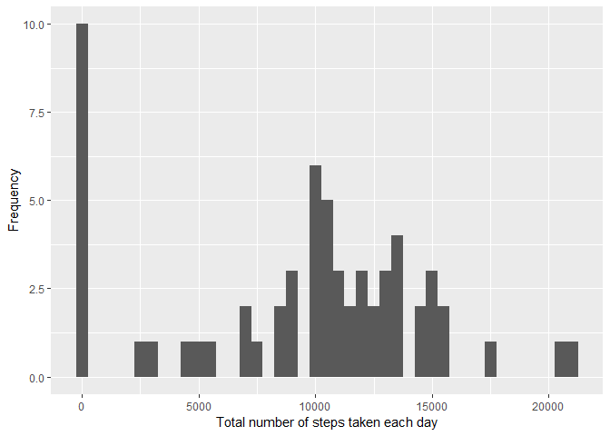
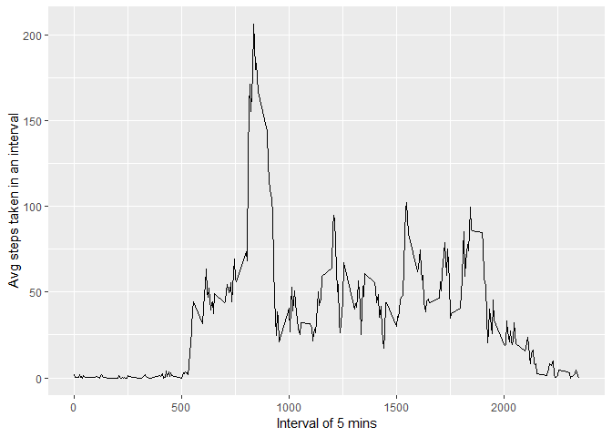
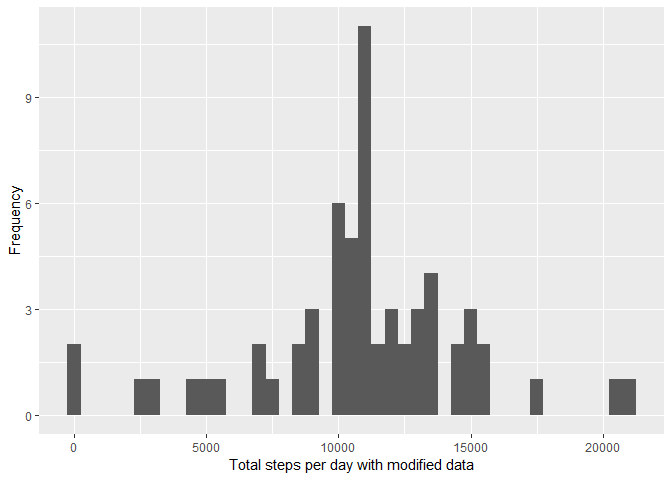
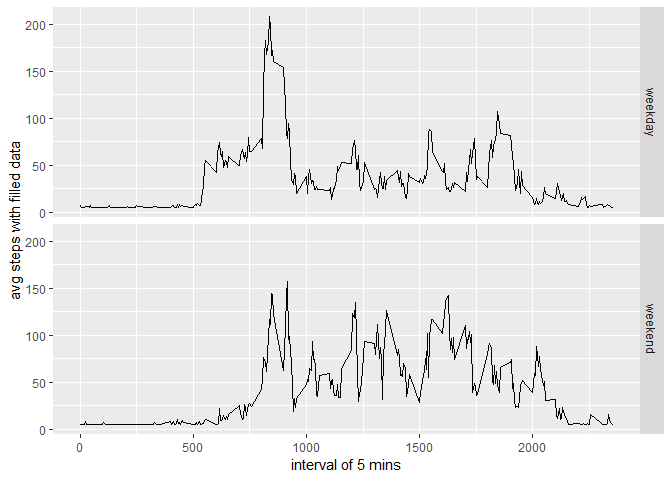

# Reproducible Research: Peer Assessment 1


```r
library(ggplot2)
library(scales)
library(Hmisc)
```

## Loading and preprocessing the data
##### 1. Load the data (i.e. read.csv())

```r
if(!file.exists('activity.csv')){
    unzip('activity.zip')
}
activityData <- read.csv('activity.csv')
```
##### 2. Process/transform the data (if necessary) into a format suitable for your analysis

```r
#activityData$interval <- strptime(gsub("([0-9]{1,2})([0-9]{2})", "\\1:\\2", activityData$interval), format='%H:%M')
```

-----

## What is mean total number of steps taken per day? 

```r
StepsPerDay <- tapply(activityData$steps, activityData$date, sum, na.rm=TRUE)
```

##### 1. Make a histogram of the total number of steps taken each day

```r
qplot(StepsPerDay, xlab='Total number of steps taken each day', ylab='Frequency', binwidth=500)
```

<!-- -->

##### 2. Calculate and report the mean and median total number of steps taken per day

```r
StepsPerDayMean <- mean(StepsPerDay)
StepsPerDayMedian <- median(StepsPerDay)
```
* Mean: 9354.2295082
* Median:  10395

-----

## What is the average daily activity pattern?

```r
avg_daily_act <- aggregate(x=list(meanSteps=activityData$steps), by=list(interval=activityData$interval), FUN=mean, na.rm=TRUE)
```

##### 1. Make a time series plot

```r
ggplot(data=avg_daily_act, aes(x=interval, y=meanSteps)) +
    geom_line() +
    xlab("Interval of 5 mins") +
    ylab("Avg steps taken in an interval") 
```

<!-- -->

##### 2. Which 5-minute interval, on average across all the days in the dataset, contains the maximum number of steps?

```r
max_steps <- which.max(avg_daily_act$meanSteps)
max_steps_time <-  gsub("([0-9]{1,2})([0-9]{2})", "\\1:\\2", avg_daily_act[max_steps,'interval'])
```

* Most Steps at: 8:35

----

## Imputing missing values
##### 1. Calculate and report the total number of missing values in the dataset 

```r
missing_freq <- length(which(is.na(activityData$steps)))
```

* Number of missing values: 2304

##### 2. Devise a strategy for filling in all of the missing values in the dataset.
##### 3. Create a new dataset that is equal to the original dataset but with the missing data filled in.

```r
filled_data <- activityData
filled_data$steps <- impute(activityData$steps, fun=mean)
```


##### 4. Make a histogram of the total number of steps taken each day 

```r
steps_filled <- tapply(filled_data$steps, filled_data$date, sum)
qplot(steps_filled, xlab='Total steps per day with modified data', ylab='Frequency', binwidth=500)
```

<!-- -->

##### ... and Calculate and report the mean and median total number of steps taken per day. 

```r
steps_filled_mean <- mean(steps_filled)
steps_filled_median <- median(steps_filled)
```
* Mean (Imputed): 1.0766189\times 10^{4}
* Median (Imputed):  1.0766189\times 10^{4}


----

## Are there differences in activity patterns between weekdays and weekends?
##### 1. Create a new factor variable in the dataset with two levels – “weekday” and “weekend” indicating whether a given date is a weekday or weekend day.


```r
filled_data$dateType <-  ifelse(as.POSIXlt(filled_data$date)$wday %in% c(0,6), 'weekend', 'weekday')
```

##### 2. Make a panel plot containing a time series plot


```r
avg_activity_filled <- aggregate(steps ~ interval + dateType, data=filled_data, mean)
ggplot(avg_activity_filled, aes(interval, steps)) + 
    geom_line() + 
    facet_grid(dateType ~ .) +
    xlab("interval of 5 mins") + 
    ylab("avg steps with filled data")
```

<!-- -->
